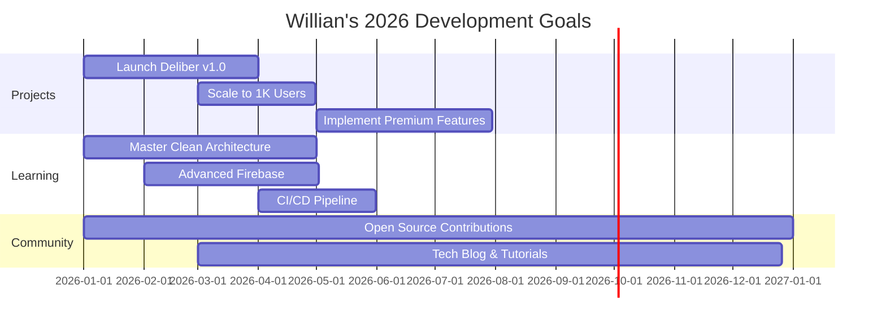

# 🌟 WILLIAN CRD 🌟

  

---

## ⚡ TECH ARSENAL

### 🎯 Core Technologies

<table>
  <tr>
    <td align="center" width="96">
      
       Flutter
    </td>
    <td align="center" width="96">
      
       Dart
    </td>
    <td align="center" width="96">
      
       Firebase
    </td>
    <td align="center" width="96">
      
       Google Cloud
    </td>
    <td align="center" width="96">
      
       JavaScript
    </td>
    <td align="center" width="96">
      
       TypeScript
    </td>
  </tr>
  <tr>
    <td align="center" width="96">
      
       Node.js
    </td>
    <td align="center" width="96">
      
       PostgreSQL
    </td>
    <td align="center" width="96">
      
       Git
    </td>
    <td align="center" width="96">
      
       GitHub
    </td>
    <td align="center" width="96">
      
       VS Code
    </td>
    <td align="center" width="96">
      
       Android Studio
    </td>
  </tr>
</table>

### 🔥 Expertise Level

---

## 🎯 2026 ROADMAP

